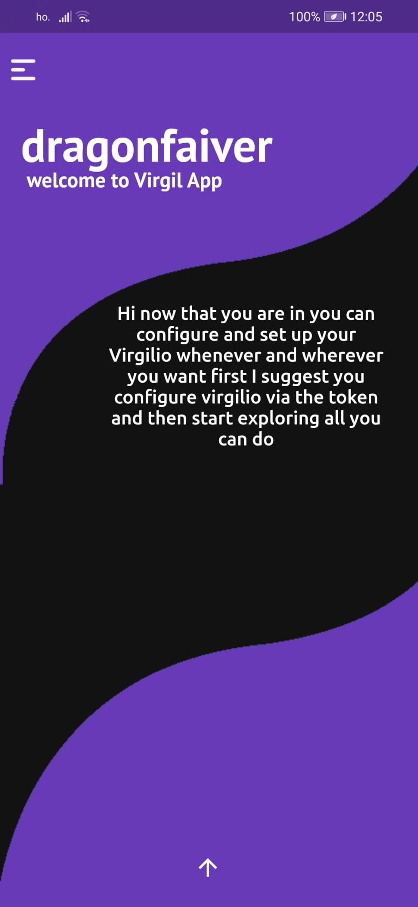
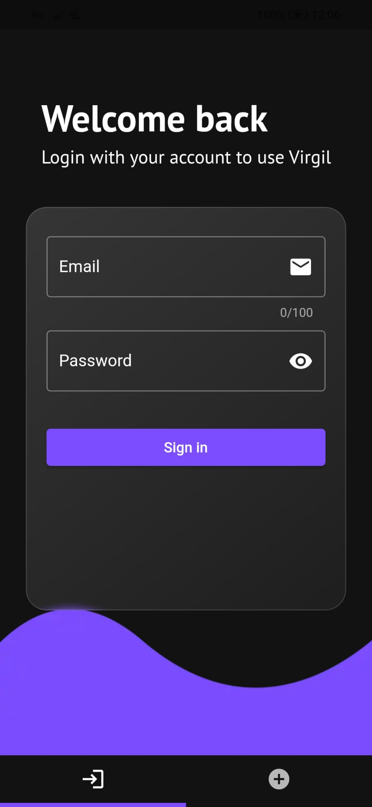
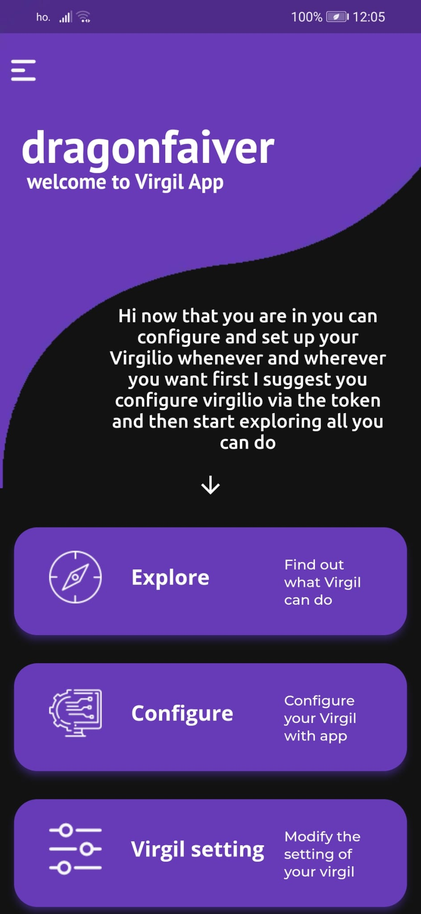
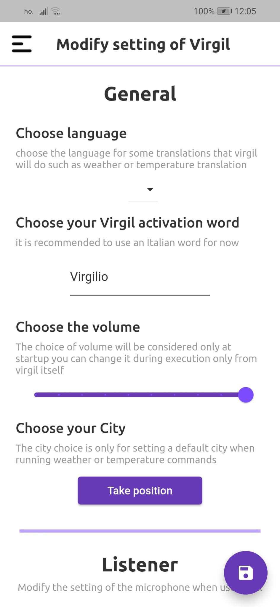
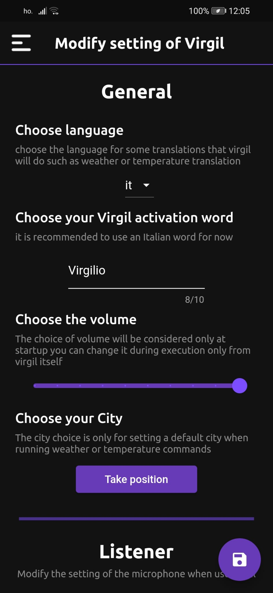
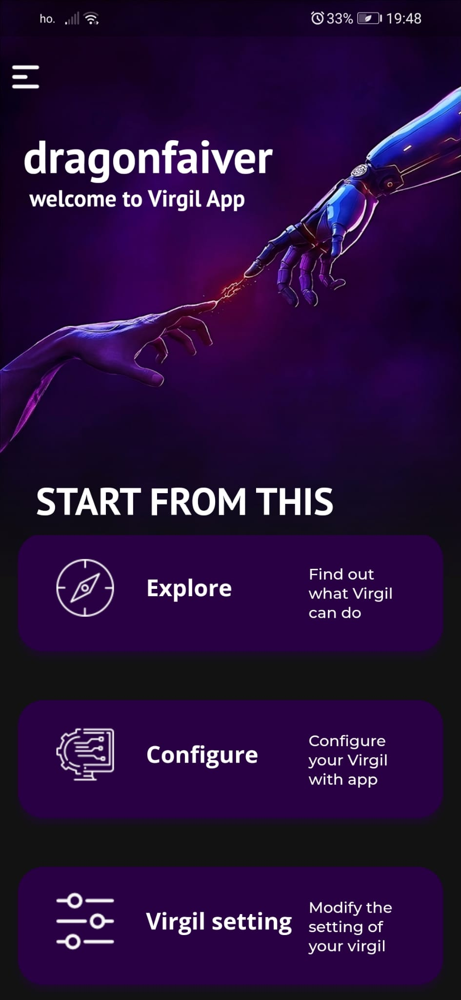

# Virgil App

## Description 📃
Virgil app is an app mobile created with [Dart](https://dart.dev/) and framework [Flutter](https://flutter.dev/)

### **Virgil-App** 📱

## Getting Started 📋
The app born for the configuration and manage setting of part project main [Virgil](https://github.com/Retr0100/ProjectVirgil) 

## API and Extern 💸
- API created by me with Flask and Python to link the settings management from the application to change the settings of Virgil on different device.
- Login manage by [Firebase](https://firebase.google.com/products/)

## Some screen of the App 📸
|  |  |
|  |  |
 |  |

## INFO
For more info see the principle page on the [project Virgil](https://github.com/Retr0100/ProjectVirgil)

## RoadMap 🎯

- [x] Write the press release
- [X] Upgrade the method of send update setting
- [x] Improve the design and the visual feedback
- [ ] Add new interaction in the page explore

